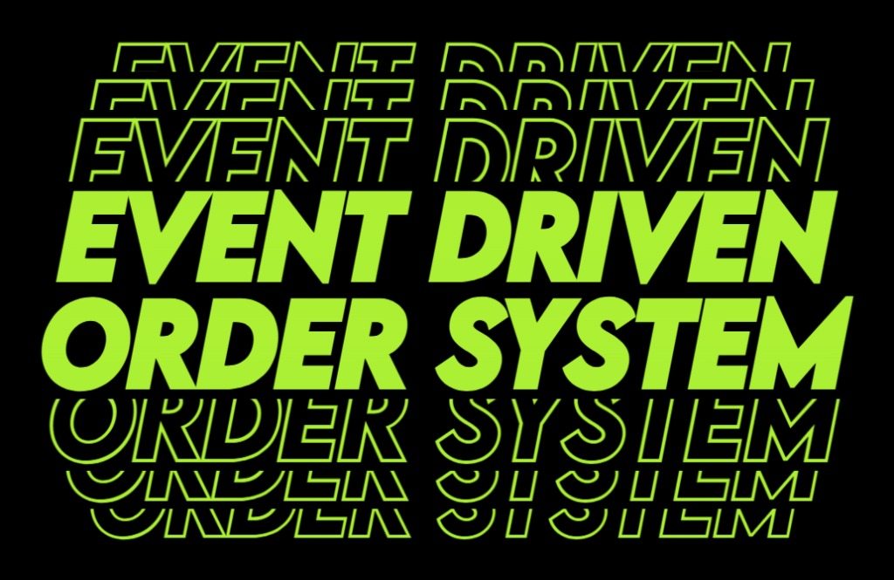

---

## Overview

This fully functional **RESTful backend** serves e-commerce applications. Designed with modern software engineering principles and built with **Spring Boot**, it provides robust API endpoints for managing users, products, transactions, and reviews, as well as with data persistence and test coverage.

This **distributed event-driven order processing system** is built using a microservices architecture and simulates how modern e-commerce platforms process orders asynchronously using message brokers and loosely coupled services.

The system is composed of four independent services:
- **Order Service**
- **Payment Service**
- **Inventory Service**
- **Notification Service**

Each service owns its data and communicates with other services through **asynchronous domain events** using **RabbitMQ**.

When a client creates an order, the **Order Service** persists the order and publishes an OrderCreated event. This event triggers a sequence of asynchronous operations handled by other services, including payment processing, inventory reservation, and user notifications.

The system implements several **reliability and distributed systems patterns**, including:
- **Event-driven communication**
- **Idempotent message processing**
- **Retry mechanisms for failure recovery**
- **Transactional Outbox Pattern for reliable event publishing**

This architecture demonstrates how microservices can coordinate complex workflows **without tight coupling or synchronous service dependencies**.

---

## Features

- **Event-Driven Microservices Architecture** – Services communicate exclusively through **RabbitMQ events**, avoiding synchronous service-to-service calls and enabling loose coupling and scalability.
- **Asynchronous Order Processing** – Order workflows are processed asynchronously allowing services to operate independently while still participating in the same business workflow. 
- **Idempotent Message Processing** – Each service implements **idempotency safeguards** to ensure that duplicate messages (a common occurrence in distributed systems) do not result in duplicate operations.
- **Retry Logic for Fault Tolerance** – Transient failures during event handling are automatically retried, improving the resilience of the system.
- **Transactional Outbox Pattern** – The **Transactional Outbox Pattern** ensures that events are reliably published to RabbitMQ **only after database transactions succeed**, preventing inconsistencies between persisted data and emitted events.
- **Independent Data Ownership** – Each microservice manages its own persistence layer using **Spring Data JPA** and **MySQL**, following the **Database per Service** pattern.
- **Message Routing with RabbitMQ** – To enable flexible routing and service decoupling, RabbitMQ exchanges and routing keys are used to direct events to the appropriate queues
- **Domain Simulation** – Simulation of an order lifecycle including: Order creation → Payment processing → Inventory reservation → Customer notifications

---

## Installation & Usage

## Usage
- Ensure Docker is installed and running, then:
```bash
cd event-driven-order-system
```
```bash
docker compose up
```
- Run Order Service and make a POST request to http://localhost:8080/api/orders with an order. For example: 
```
{
	"customerId": "789", 
	"currency": "USD", 
	"items": [ 
		{ "productId": "A1", "quantity": 1, "price": 50.00 }, 
		{ "productId": "A9", "quantity": 1, "price": 25.00 } 
	]
}
```
- Run the remaining microservices (Payment, Inventory and Notification) to process the order.
- Open RabbitMQ Management at http://localhost:15672/ and/or MySQL Workbench 8.0 CE to better visualize the data flow.

---

## Summary of Architecture Patterns Used
- Event-Driven Architecture
- Microservices Architecture
- Transactional Outbox Pattern
- Idempotent Consumers
- Retry Handling
- Database per Service
- Asynchronous Messaging with RabbitMQ